# thinkjs-iview-admin
thinkjs-iview-admin 是一个轻量级的快速开发后台管理系统架构, 以Thinkjs作为中间层, Vuejs作为前端模块化开发, iview-admin作为前端UI, 实现了前后端分离

## 后端项目：back-end
- sql文件导入到本地数据库即可

```bush
//安装依赖：
npm install
```

```bush
//启动程序：
npm start
```


## 前端项目：front-end
- 超级管理员帐号为admin 111111，后台所有帐号的默认密码都为111111


```bush
// 安装依赖：
npm install
```


```bush
//启动开发环境：
npm run dev
```


```bush
//打包正式环境：
npm run build
```


## 代码生成器的使用方法

- 创建表的时候最好填写表的描述和各个字段的描述。
- id（主键）,create_date（创建时间）,update_date（修改时间）,del_flag（软删除标记）  四个字段缺一不可。
- 在代码生成器中选择表名，然后配置，点击“生成代码”即可！


## 功能

- 登录/登出
- 系统管理
    - 用户管理
    - 菜单管理
    - 角色管理
    - 字典管理
    - 代码生成器
- 多语言切换
- 个人中心
- 锁屏
- 全屏
- 错误页面
- DEMO页面
    - 。。。。就不一一列举了


## 参考Links

- [thinkjs](https://github.com/thinkjs/thinkjs)
- [iView](https://github.com/iview/iview)
- [iView-admin](https://github.com/iview/iview-admin)
- [Vue](https://github.com/vuejs/vue)
- [Webpack](https://github.com/webpack/webpack)


## 效果展示（以下截图出自于[iView-admin](https://github.com/iview/iview-admin)）

- 响应式布局首页

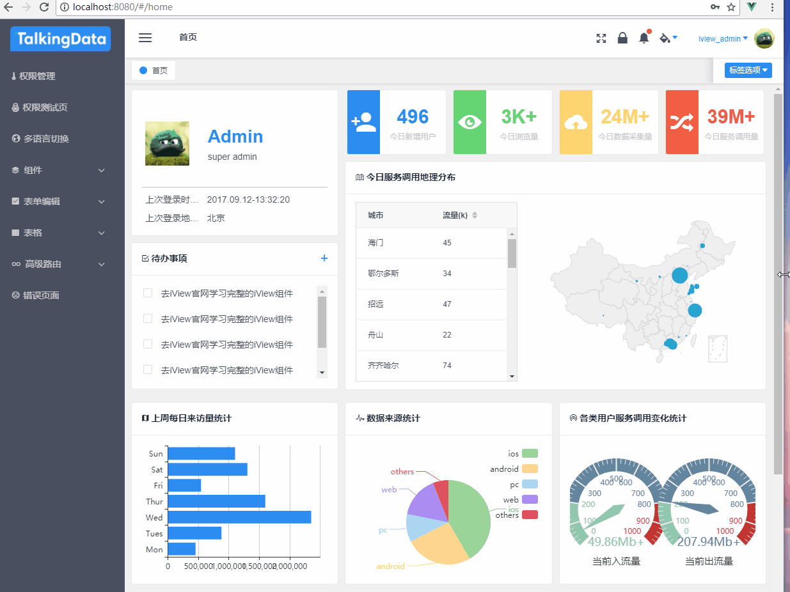

- 标签导航
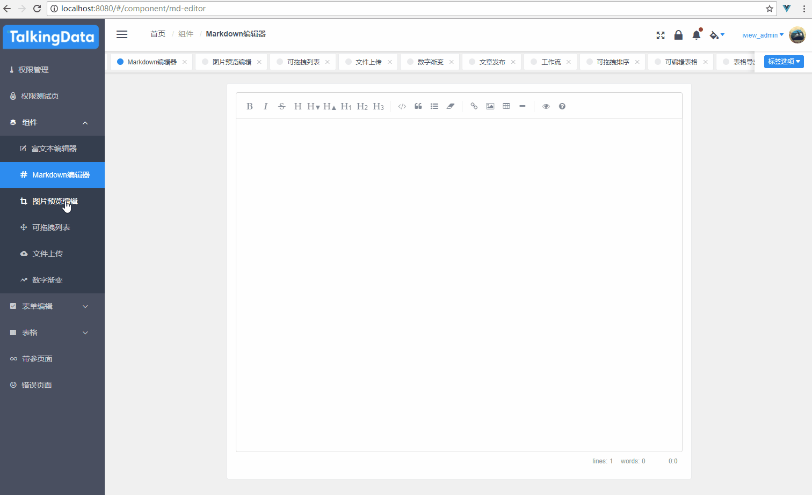

- 权限管理
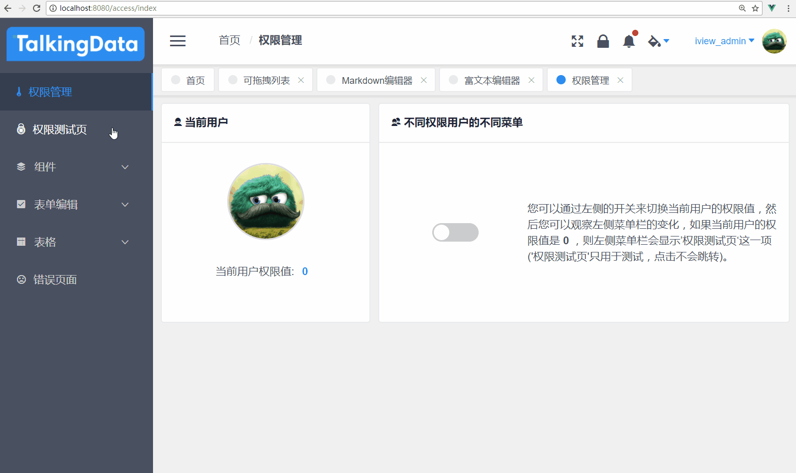

- 可拖拽列表
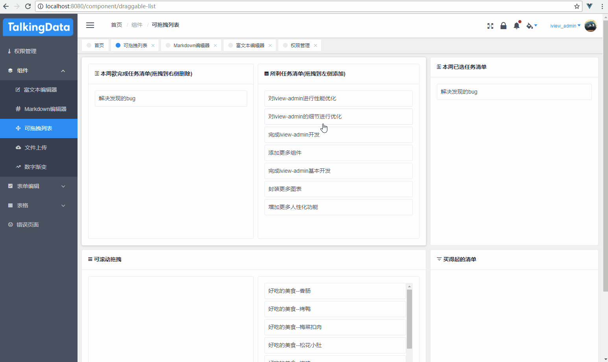

- 图片预览编辑
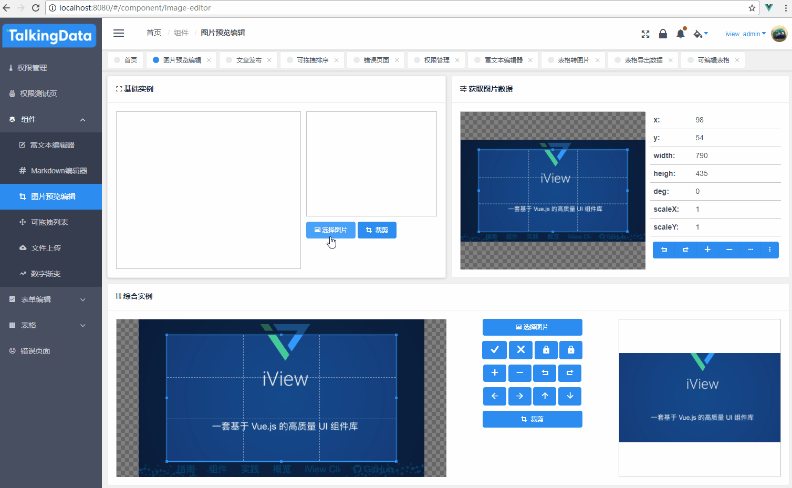

- 文件上传
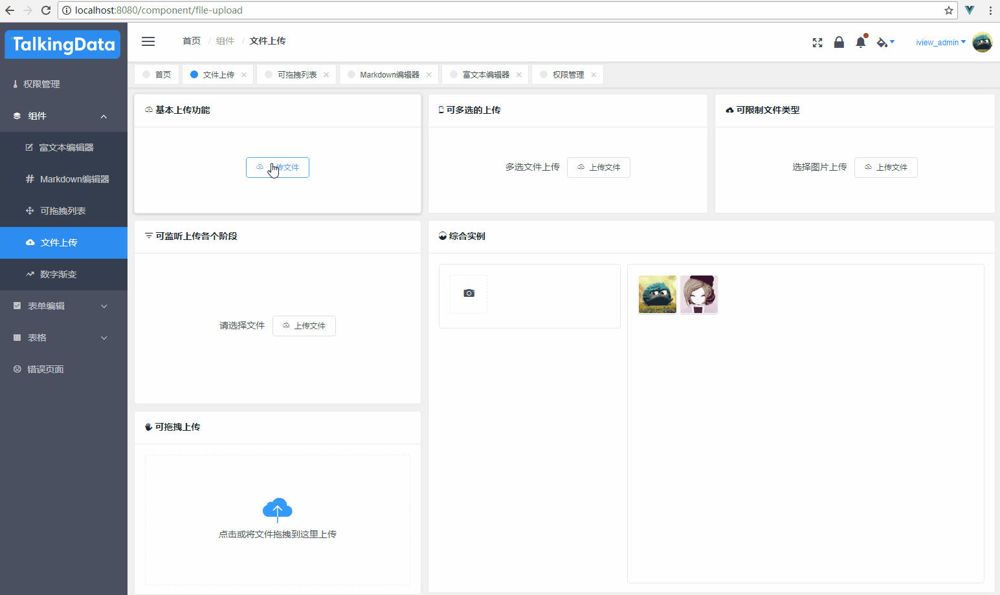

- 数字渐变
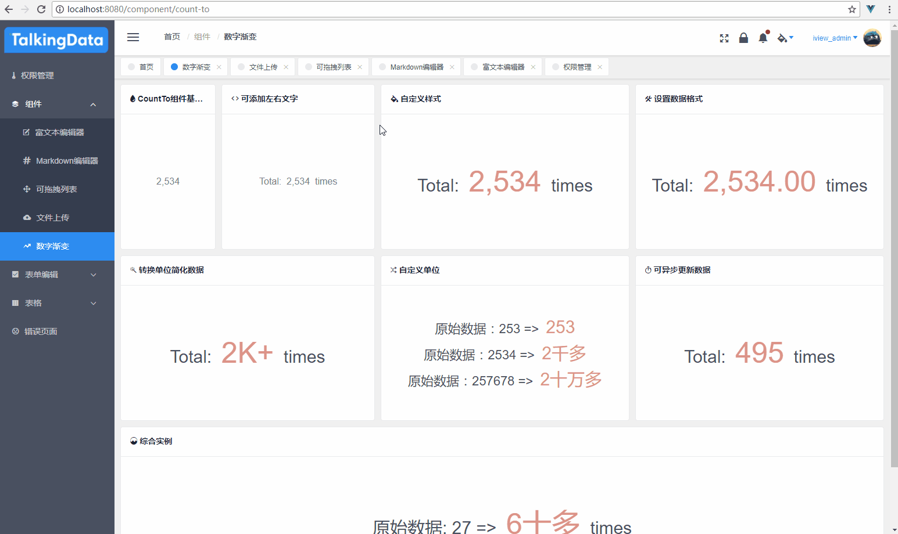

- 文章发布
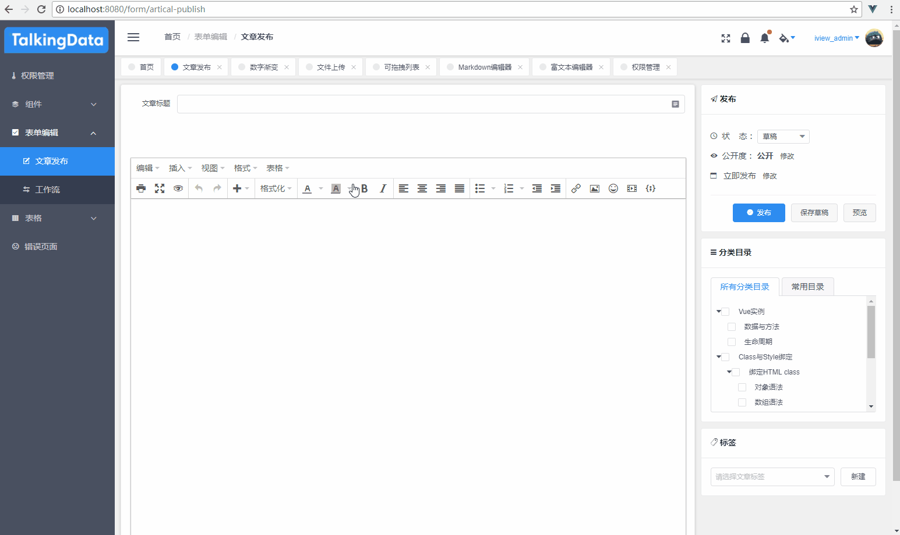

- 工作流
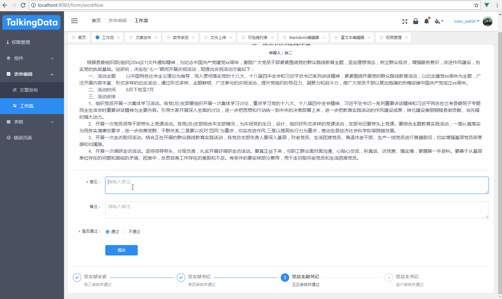

- 可拖拽表格
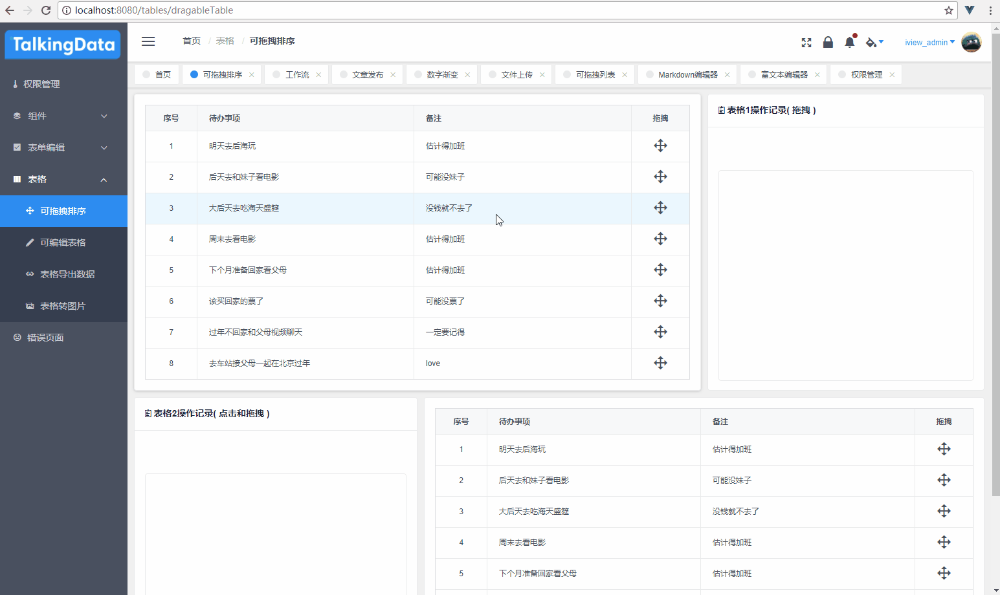

- 可编辑表格
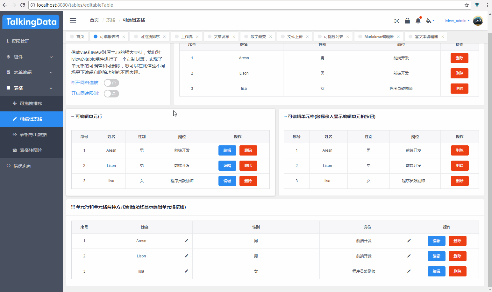

- 表格导出数据
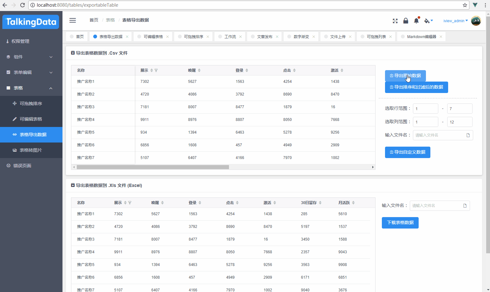

- 表格转图片
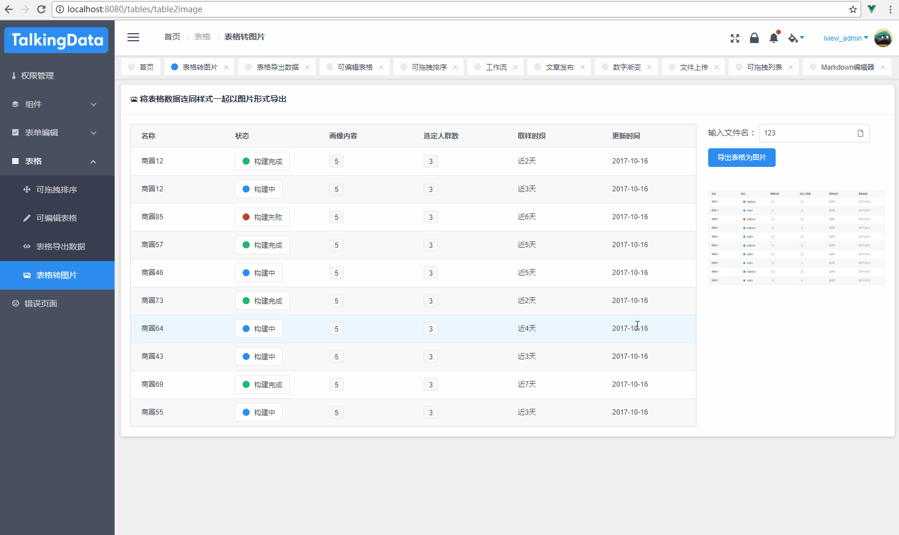

- 错误页面
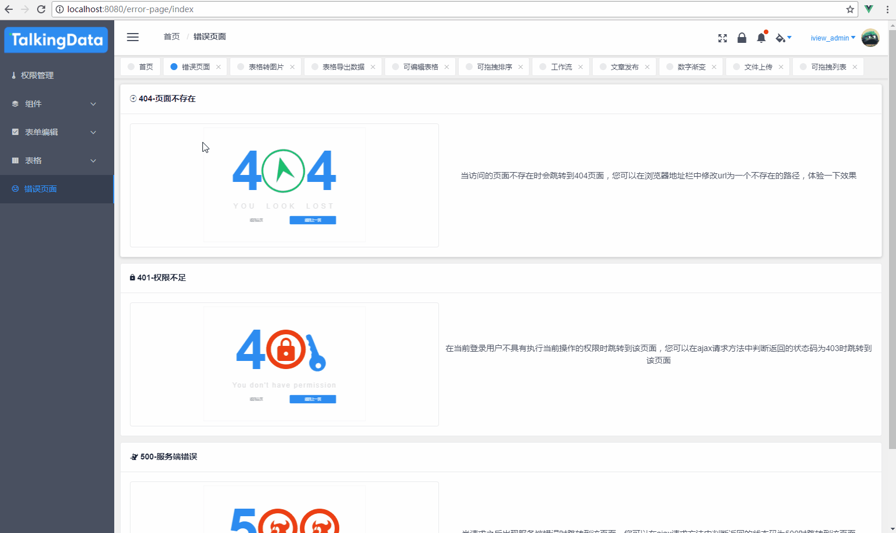

- 锁屏
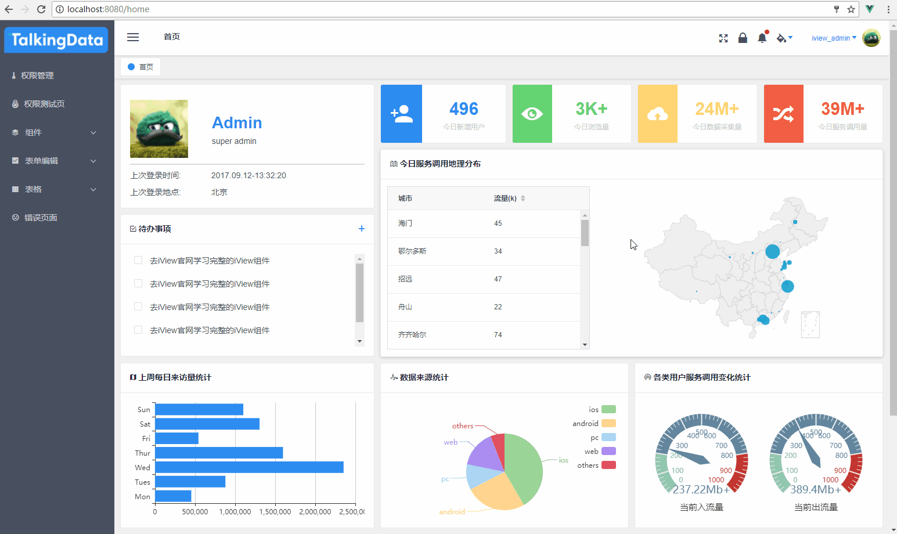

- 可收缩侧边栏
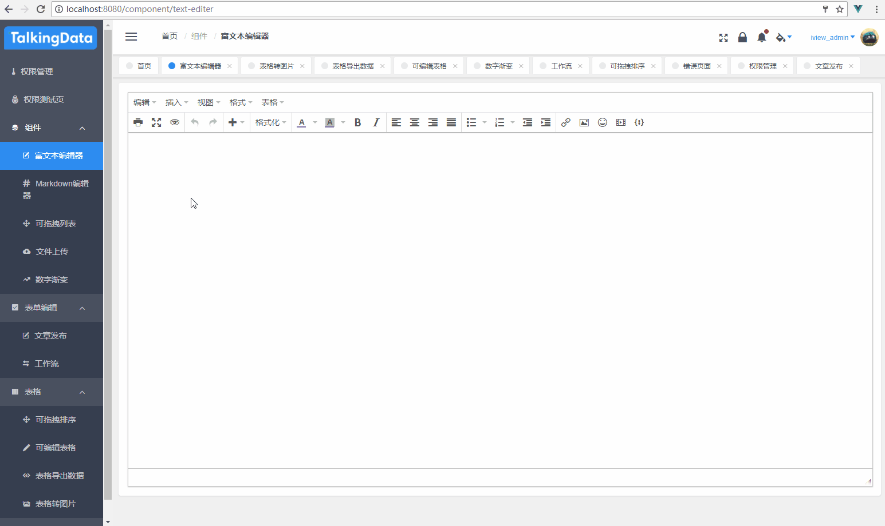s

- 主题切换
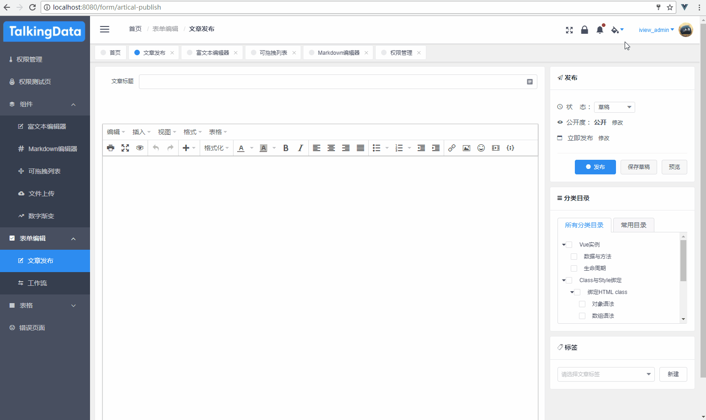

- 消息中心


- 标签导航


- 权限管理


- 可拖拽列表


- 图片预览编辑


- 文件上传


- 数字渐变


- 文章发布


- 工作流


- 可拖拽表格


- 可编辑表格


- 表格导出数据


- 表格转图片


- 错误页面


- 锁屏


- 可收缩侧边栏
s

- 主题切换


- 消息中心


